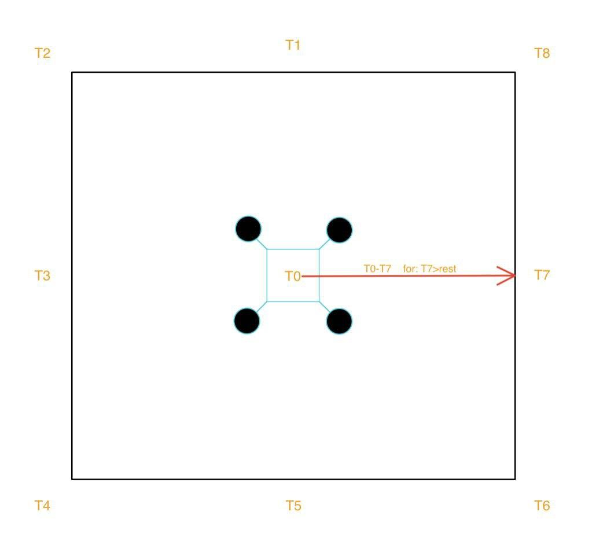

# ATLAS_Signal_Stregth_Follow_Simulation

The program consists of the implementation of the algorithm that will be used in the ATLAS Signal Strength Follow system.
The algorithm was designed by the ATLAS DEV-OPS team and implemented by Manuel E. Portela

    Algorithm:

        1--Probbing Mission-the drone moves in a square in a specific (range > 100m; range < 200m) and probes each point for a signal
        
        2--Case1: The done finds a signal
        
          2.1--Box Mission-the drone moves in a box and collects the points seen in Figure 1 below.

          2.2--It determines the strongest signal between the nine measurements.

          2.3--Case1: It creates a directional vector t0->tx, tx: being the strongest signal in the box.

            2.3.1--The drone will move in t0->tx direction as a scalar equal to the magnitude of t0->tx and collects signal strength measurements comparing them to the preview’s location measurement.

            2.3.2--Case1: The current signal is the strongest and the drone keeps moving.

            2.3.2--Case2: The current signal is weaker, and the drone moves to the preview’s location.

            2.3.3--The algorithm goes back to 1.

          2.3--Case2: t0 is the strongest signal and the algorithm stops and indicates that the animal is below inside a boxed raged relative to the box length chosen.
          
        2--Case2:The drone does not find a signal within the range^2 and returns to home displaying no signal found while probing.

